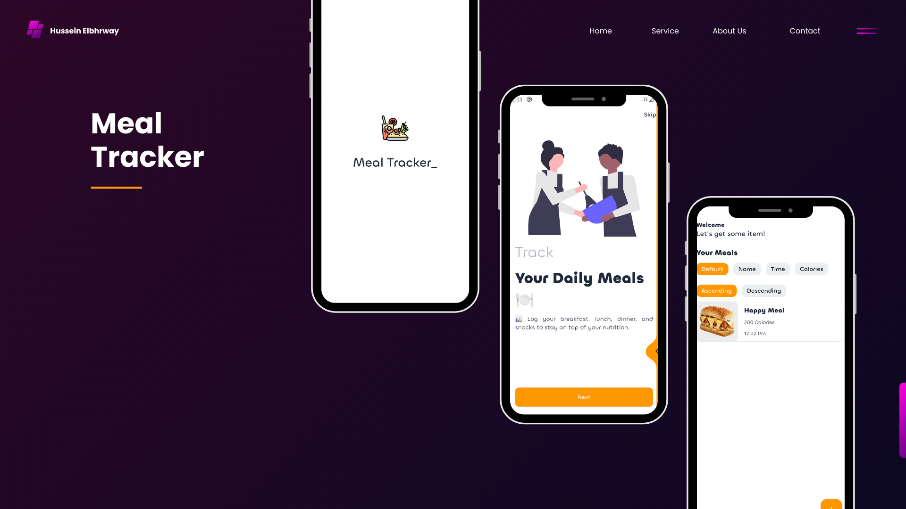
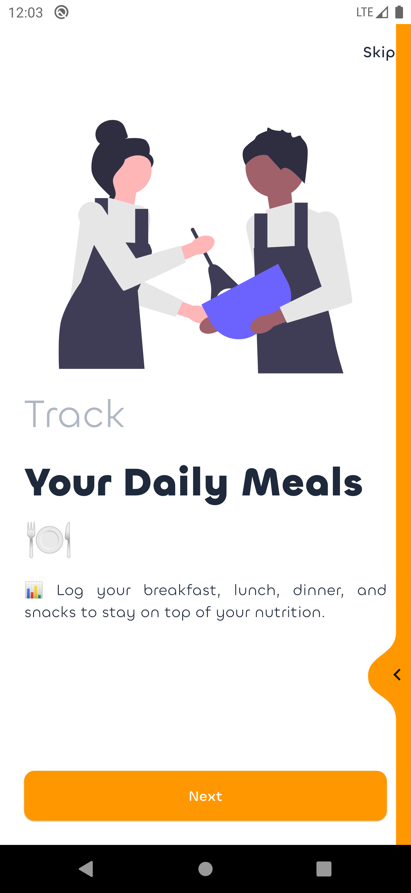
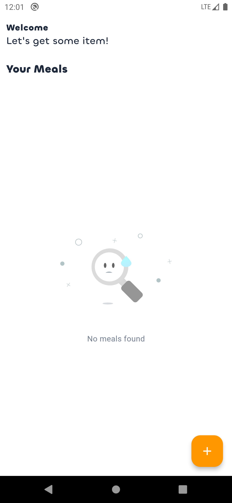
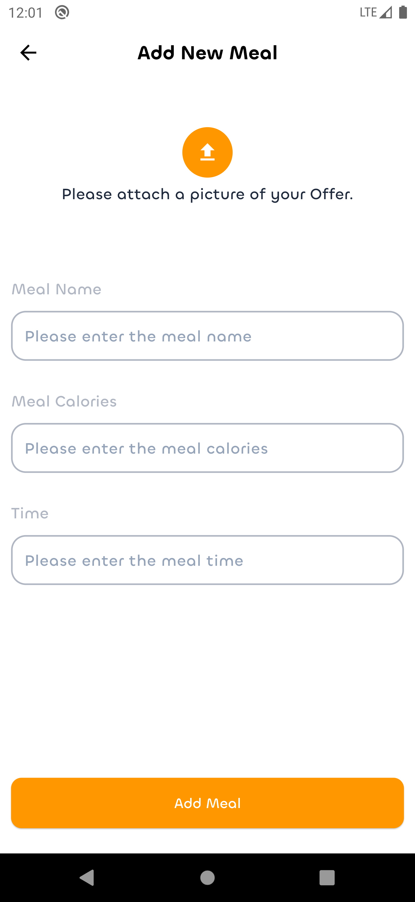
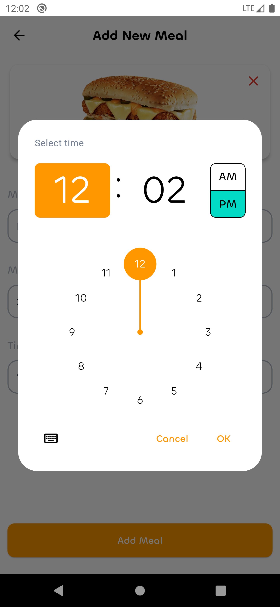
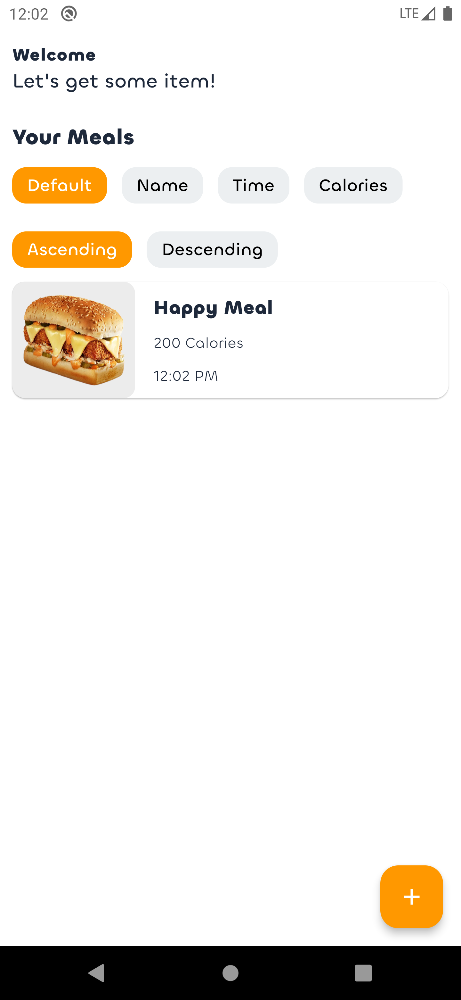
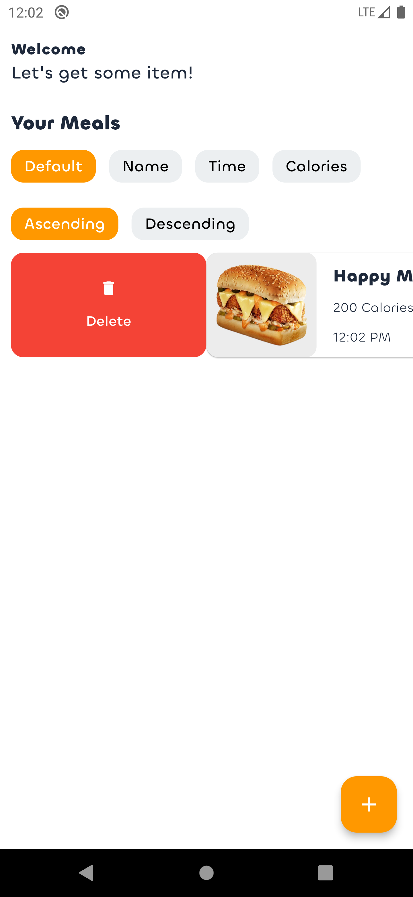

# Meal Tracker App 🍴

**Meal Tracker** is a powerful and user-friendly Meal Tracking mobile app developed using **[Flutter](https://flutter.dev/)** and **[Hive](https://pub.dev/packages/hive_flutter)**.  as Local Databatbase 

---

## 📚 Table of Contents

---

## 🌟 Features

- 🚀 **Native Splash Screen** for a smooth launch experience.
- 🎬 **Onboarding Screen** for an interactive first-time experience. 
- 🍴 **Get All Added Meals From Database**
- 🍴 **Add New Meal To Database**
- 🍴 **Delete Meal From Database**
- 🍴 **Update Meal From Database**
- 📅 **Can Sort Meals depend on (ID , Name , Time , Calories)**.
- 🔄 **CI/CD using GitHub Actions** for automated builds and testing.
---

## 📖 Documentation

### ⏳ Task Timeframe

Track the development progress with WakaTime:

---

## 🗄️ App Mockup Design

| #1                          | #2                          | #3                          | #4                          | #5                          | #6                          | #7                          |
|-----------------------------|-----------------------------|-----------------------------|-----------------------------|-----------------------------|-----------------------------|-----------------------------|
|  |  |  |  |  |  |  |
|                             |                             |                             |                             |                             |                             |                             |

---

## 📺 App Video

[final_video.mp4](Screenshots/final.mp4)

https://github.com/user-attachments/assets/e4dc2e0e-cc0d-4183-a99d-e6c98250a516

---

## 🛠️ Getting Started

### ⚡ Dependencies

- 🌐 **Responsive UI** — [flutter_screenutil](https://pub.dev/packages/flutter_screenutil)
- 🌊 **Smooth Page Swiping** — [liquid_swipe](https://pub.dev/packages/liquid_swipe)
- 🎥 **Lottie Animations** — [lottie](https://pub.dev/packages/lottie)
- 🔥 **Toast Notifications** — [bot_toast](https://pub.dev/packages/bot_toast)
- ♻️ **Value Comparison Utility** — [equatable](https://pub.dev/packages/equatable)
- 💾 **Local Storage** — [shared_preferences](https://pub.dev/packages/shared_preferences)
- 🎨 **SVG Image Support** — [flutter_svg](https://pub.dev/packages/flutter_svg)
- 🎬 **Smooth Animations** — [flutter_animate](https://pub.dev/packages/flutter_animate)
- ✨ **Animated Text Effects** — [animated_text_kit](https://pub.dev/packages/animated_text_kit)
- 🚀 **Native Splash Screen** — [flutter_native_splash](https://pub.dev/packages/flutter_native_splash)
- 📌 **Dependency Injection** — [get_it](https://pub.dev/packages/get_it)
- 🎭 **Slideable List Items** — [flutter_slidable](https://pub.dev/packages/flutter_slidable)
- 📂 **File Picker** — [file_picker](https://pub.dev/packages/file_picker)
- 🌎 **Date & Time Formatting** — [intl](https://pub.dev/packages/intl)
- 🐝 **Lightweight NoSQL Database** — [hive](https://pub.dev/packages/hive)
- 🐝 **Hive Flutter Integration** — [hive_flutter](https://pub.dev/packages/hive_flutter)
- ⚙️ **Hive Code Generation** — [hive_generator](https://pub.dev/packages/hive_generator)
- 📂 **File System Access** — [path_provider](https://pub.dev/packages/path_provider)
- 🎭 **Functional Programming Helpers** — [dartz](https://pub.dev/packages/dartz)
- 🔄 **State Management** — [flutter_bloc](https://pub.dev/packages/flutter_bloc)

### ⚡ Dev Dependencies

- 📱 **App Icons Management** — [flutter_launcher_icons](https://pub.dev/packages/flutter_launcher_icons)
- 🔧 **Code Generation & Automation** — [build_runner](https://pub.dev/packages/build_runner)
- ✅ **Testing & Linting** — [flutter_lints](https://pub.dev/packages/flutter_lints)
---

### 📱 Download APK

- [MediaFire](https://www.mediafire.com/file/8dznh2zlxg6399c/app-release.apk/file)

🚀 **Happy Coding!** 🎉

